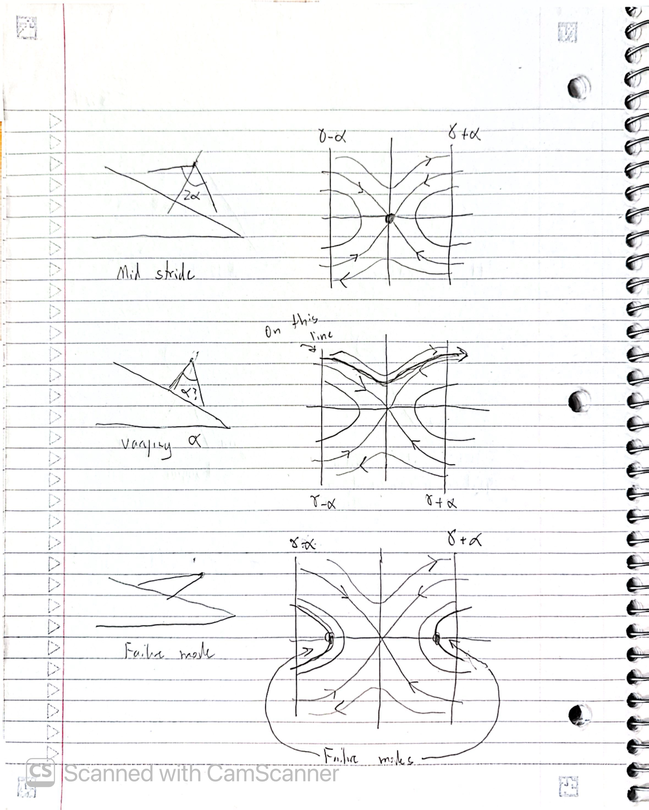
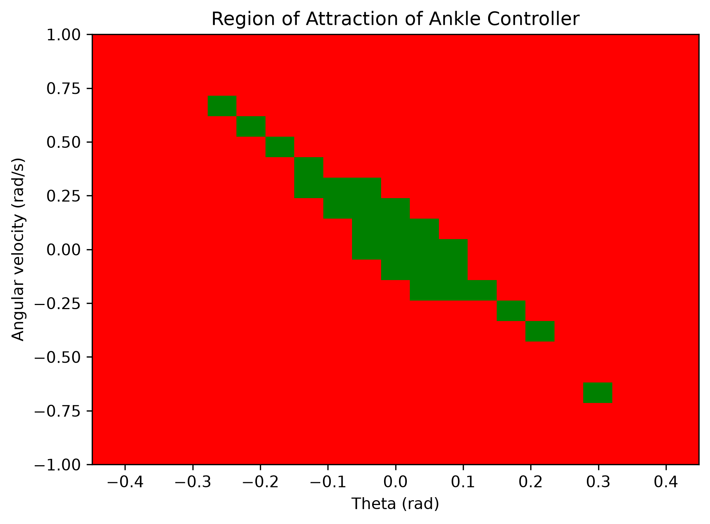
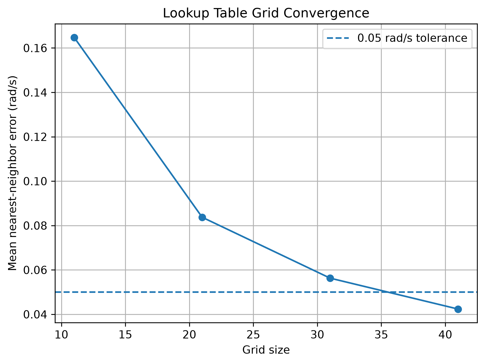
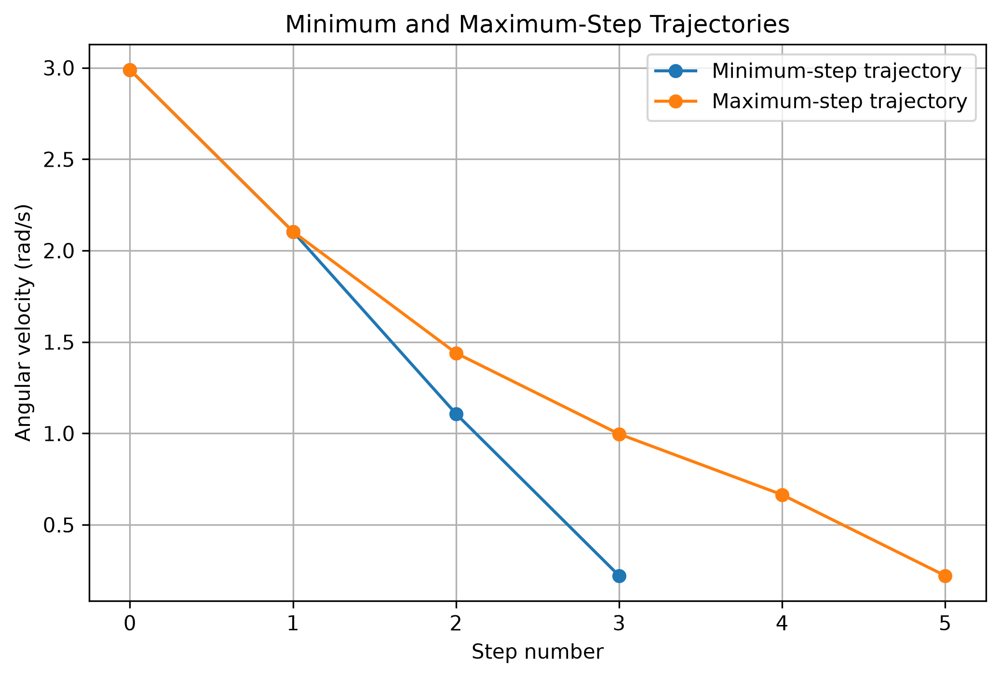
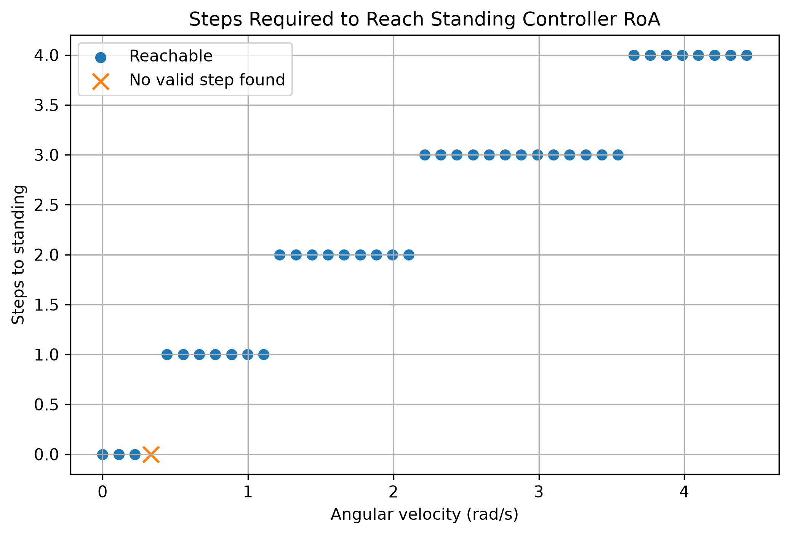

## Assignment 2
# 1. Sketches

Attached above is the sketch of the inverted pendulum in three different states (Mid stride, Varying alpha, and Failure mode) along with their corresponding state space sketches. 

# 2. Visualization of the region of attraction for your ankle-controller

The RoA grid was determined by testing various inital conditions. For each condition, a test of 3 seconds was applied, and the pendulum was analyzed to see if it could remain stable. Resulting plot shows the RoA regions. Is it interesting to note that while there seems to be a pattern of where the green sucessful stable squares occur, one green square occurs on the bottom right far away from the rest of the green squares. This could either mean that that is a true RoA square, or it could indicate a some numerical issue that is occuring.

# 3. Choice of Poincaré section

The Poincaré section was chosen at $\theta=0$ with positive angular velocity after a foot strike. This represents the walker passing through the upright position at each step, and provides a consistent point at which the state of the walker can be recorded from one step to the next.

# 4. How you verified your grid resolution

To choose a proper grid resolution, I calculated the mean nearest-neighbor error for the the folowing grid sizes: 11 by 11, 21 by 21, 31 by 31, and 41 by 41. This involvd taking the average of the sum of all the errors using the nearest grid instead of the exact number. I chose for maximum error to be 0.05. 

The following produced: 

Grid 11x11: mean nearest-neighbor error = 0.164752 rad/s
Grid 21x21: mean nearest-neighbor error = 0.083734 rad/s
Grid 31x31: mean nearest-neighbor error = 0.056288 rad/s
Grid 41x41: mean nearest-neighbor error = 0.042361 rad/s

As a result, the 41 by 41 grid was chosen. This choice was a good balance of accuracy and runtime, as because I used the rk4 integrator the simulations take longer to run. 

# 5. Trajectory for an initial condition that requires at least 3 steps

An initial angular velocity of approximately 3 rad/s was selected because this initial condition requires at least 3 steps to reach the RoA. Using the same initial condition, the walker could take a maximum of 5 steps before reaching the RoA, depending on the sequence of $\alpha=0$ values chosen for the subsequent steps. These $\alpha=0$ values represent the different foot-placements available to the walker.

# 6. A visualization of how many steps

For each angular velocity on the Poincaré section, a backward search was performed to determine the minimum number of steps required to reach the ankle-controller RoA. The resulting plot shows how many walking steps are required before the ankle controller can take over and bring the walker to standstill. There is an interesting case at which the angualr velocity of just under 0.5rad/s leads to a failure, while angular velocities both lower and higher succussfully reach the RoA. My debugging efforts produced the following:

Unreachable velocity: 0.3322085188552515
Next velocities: [nan nan nan nan nan nan nan nan nan nan nan nan nan nan nan nan nan nan
 nan nan nan nan nan nan nan nan nan nan nan nan nan nan nan nan nan nan
 nan nan nan nan nan]

 Which shows that this could be a true failure rather than a backward-search issue, but could also be an rk4 integrator issue. 